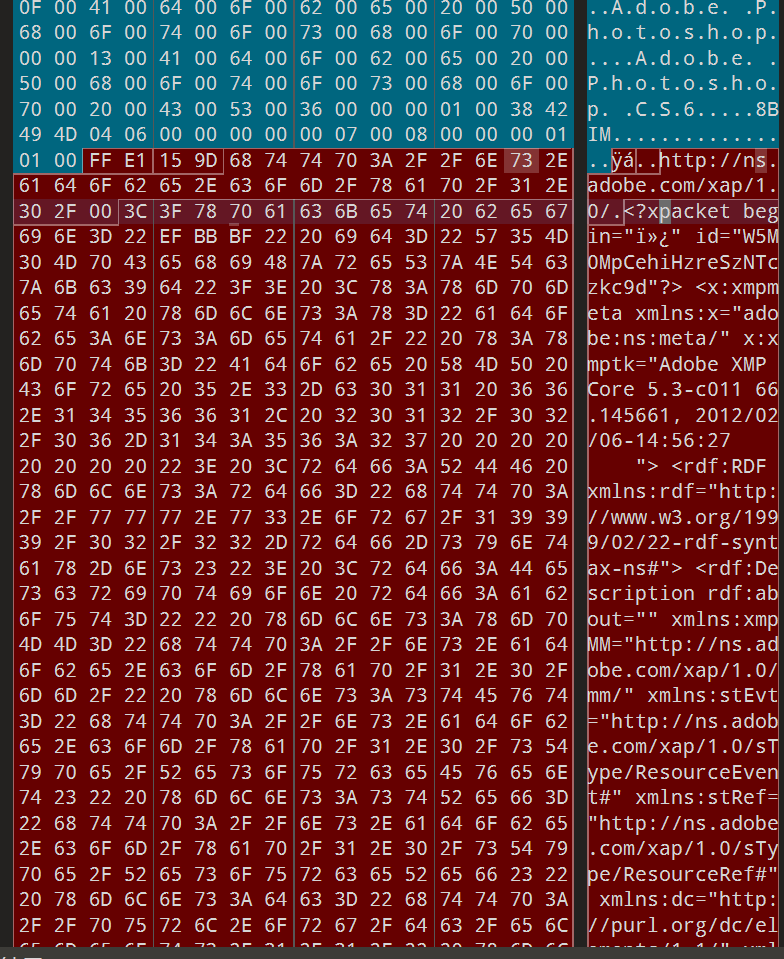
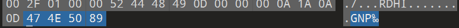
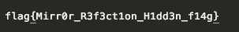

# 3-mirror[网鼎杯](https://ctf.bugku.com/challenges/index/gid/2/tag/145.html)

[2018](https://ctf.bugku.com/challenges/index/gid/2/tag/146.html)

> mirror是提示

使用010打开，发现并不是单纯的一张图片呢，而是多种文件符合而成

> 

1. jpg文件开头：FF D8 FF
2. jpg文件结尾：FF D9
3. png正常文件开头：89 50 4E 47

## 尝试理解

题目的意思是mirror的意思就是已经把一些数字调转过来了

## 思路

在其中搜索16进制字节DD D9

并且找到了反转16进制



```
with open("flag.jpg",'rb') as f://二进制只读，图片/压缩包等所有非文本文件，都要用 rb 打开
    data = f.read()
    r = data[::-1]
    with open('dec.png', 'wb') as w:
        w.write(r)
```



## 脚本含义解读

1. > with open("flag.jpg",'rb') as f:
   >
   > //二进制只读，图片/压缩包等所有非文本文件，都要用 rb 打开

2. > `[::-1]` 是 Python 最常用的**反转语法**

3. > with open('dec.png', 'wb') as w:新建一个文件叫 `dec.pngg`，

4. > `'wb'`：二进制写入

