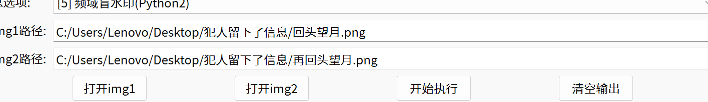
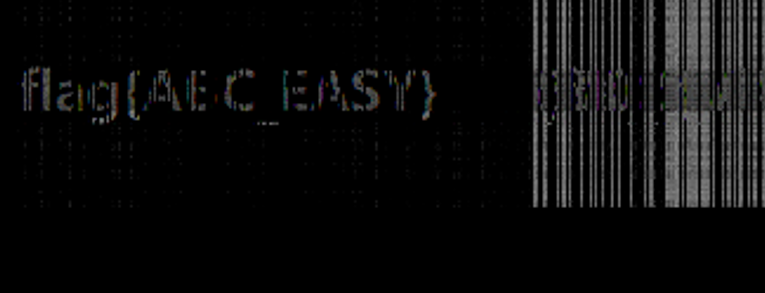

# 好像说太多了

                                                                [Xp0intCTF](https://ctf.bugku.com/challenges/index/gid/2/tag/106.html)

[2017](https://ctf.bugku.com/challenges/index/gid/2/tag/107.html)

> 好像说太多了
> flag{}

```
vtsegdt zg gxk egdhtzozogf!zgrqn ol q foet rqn,o ight ziqz ngx eqf vof zit hkomt qfr liqkt oz vozi dt.gxk ztqd ol wtlz of dn dofr,wxz o qd zgg vtqa.lg o qd vgkaofu iqkr zg lzxrn.zit dglz odhgkzqfz ziofu ol ziqz o voss ztss ngx q ltetkz ziqz zit ysqu ol vgkryktjxtfenqfqsnlol.zit zkgxwst ol ziqz ziol qfqsnlol fttrl dgkt zg qfqsnmt, lg o qd ugofu zg iqct q eiqz vozi ngx.wxz o rg fgz afgv viqz zg zqsa qwgxz vozi ngx, o qd ctkn iqkr, o ight ngx eqf ygkuoct dt. 
```

这是题目给出的文件，发现是一堆乱序

尝试自频分析：

没有得到flag

使用https://quipqiup.com/

```
welcome to our competition!today is a nice day,i hope that you can win the prize and share it with me.our team is best in my mind,but i am too weak.so i am working hard to study.the most important thing is that i will tell you a secert that the flag is wordfrequencyanalysis.the trouble is that this analysis needs more to analyze, so i am going to have a chat with you.but i do not know what to talk about with you, i am very hard, i hope you can forgive me.
```

得到后便可以解码

wordfrequencyanalysis

## 思路

这是一道单表对应题目，英语中有对应的

> 标准频率顺序E > T > A > O > I > N > S > H > R

这个题目进行统计后进行单表兑换

> 密文频率：z > t > g > o > i 

就是z = E，t = T

但是如果这样做不出来

就会错位排列

# 犯人留下了信息[Xp0intCTF](https://ctf.bugku.com/challenges/index/gid/2/tag/106.html)

[2017](https://ctf.bugku.com/challenges/index/gid/2/tag/107.html)

> 犯人留下了信息

题目给了两张图片，经过常规产看后并没有发现什么东西，于是使用puzzle进行双图py盲水印操作





flag{ABC_EASY}

## 总结

这个就是把看不见的版权标记，偷偷藏在图片 / 视频的 “纹理、明暗节奏” 里，不是改表面像素，别人删不掉、看不见，你不用原图也能查出来这东西是谁的。

**频域**：看的是图片的**明暗节奏、纹理粗细、轮廓变化**，不是改单个点，就像改音乐的调子节奏，不是改单个音符

## 为什么给了两个图片呀？

第一个是原图，第二个图是水印，第二张图经过特殊的算法后，放入第一个图片，之后可以通过第二的图片提取水印